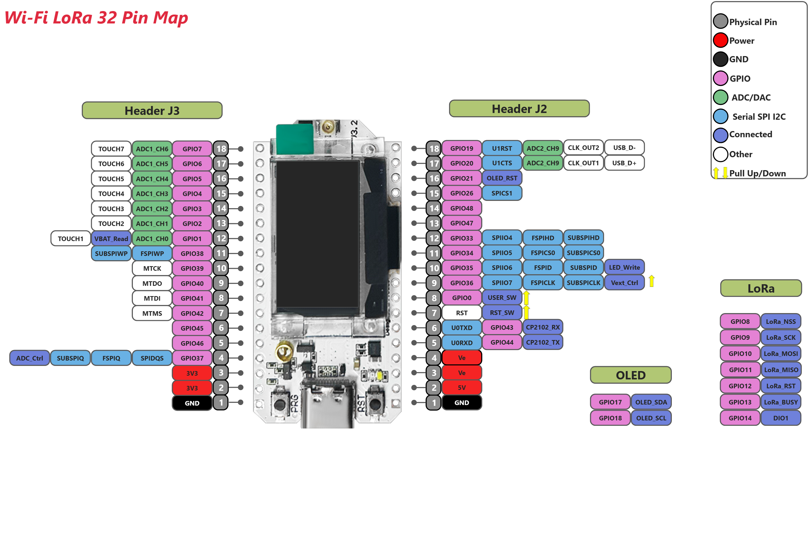

Heltec ESP32 Lora V3  
Work in progress to transmit between two nodes:  
There are 3 digital inputs - which turn on 3 digital outputs on the remote device.    
The local inputs, remote inputs, group number, remote battery voltage, RSSI and if a signal has been received in the last 20 seconds.  
Lora-test version is using spreading factor 9 and bandwidth of 500 - this results in a possible transmission every 5 ish seconds.  
Using Heltec unofficial library https://github.com/ropg/heltec_esp32_lora_v3  
[Schematic](WiFi_LoRa_32_V3.2_Schematic_Diagram.pdf)    

